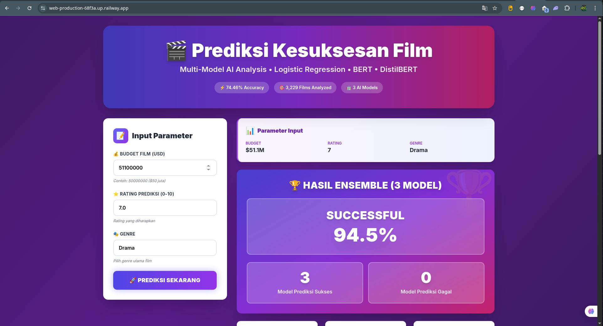

# 🎬 Prediksi Kesuksesan Film (Movie Success Prediction)

Aplikasi web berbasis **Machine Learning** untuk memprediksi tingkat kesuksesan sebuah film berdasarkan **budget, rating, dan genre**, menggunakan pendekatan **ensemble model**.

🔗 **Live Demo:**  
https://web-production-68f3a.up.railway.app

---

## 📸 Tampilan Aplikasi



---

## 🚀 Fitur Utama

- 🎯 Prediksi kesuksesan film
- 🤖 Ensemble Machine Learning (Logistic Regression)
- 📊 Probabilitas keberhasilan
- 🎬 Input: Budget, Rating, Genre
- 🌐 Web-based & responsif

---

## 🧠 Teknologi yang Digunakan

| Komponen | Teknologi |
|------|------|
| Backend | Flask |
| Machine Learning | Scikit-learn |
| Frontend | HTML, CSS |
| Deployment | Railway |
| Bahasa | Python 3 |

---

## 🧪 Model & Dataset

- Dataset: TMDB Movies
- Total data: ±3000 film
- Output: Sukses / Tidak Sukses
- Metode: Logistic Regression

---

## 📊 Contoh Output

| Parameter | Nilai |
|--------|------|
| Budget | $51,000,000 |
| Rating | 7.0 |
| Genre | Drama |
| Prediksi | ✅ SUCCESS (94.5%) |

---

## 📁 Struktur Proyek

```
Klasifikasi_Kesuksesan_Film_UAP-ML/
│
├── app.py
├── requirements.txt
├── success_model.pkl
├── success_vectorizer.pkl
├── templates/
│   ├── index.html
│   └── success.html
```

---

## 🌐 Demo Online

👉 https://web-production-68f3a.up.railway.app

---

## 👨‍💻 Author

**Dio Richard**

---

⭐ Jangan lupa beri ⭐ di GitHub jika bermanfaat!
